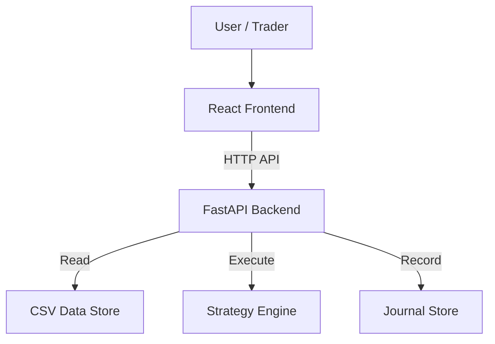

# System Architecture

## 1. High-Level Design
The system follows a **Client-Server** architecture with a clear separation of concerns.

## 2. Frontend Architecture (React + Vite)
The frontend is the "Cockpit". It manages state and visualization.

### 2.1. State Management (Context API)
-   `DataContext`: Stores loaded candles (OHLCV).
-   `AccountContext`: Stores Balance, Equity, Active Trades, History.
-   `StrategyContext`: Stores active strategy config (e.g., "4H Range", "Risk 0.5%").

### 2.2. Components
-   **`ChartContainer`**: Wrapper for `Lightweight Charts`. Handles resizing and overlay rendering.
-   **`SplitView`**: A layout component that renders two `ChartContainer` instances (e.g., Top=4H, Bottom=5M).
-   **`ControlPanel`**: Inputs for Timeframe, Asset, and Strategy toggles.
-   **`SignalPanel`**: A list view of generated signals.

## 3. Backend Architecture (FastAPI)
The backend is the "Brain". It processes data and runs logic.

### 3.1. Modules
-   **`Data Loader`**:
    -   Reads CSV files from `archive/LT1/data`.
    -   Standardizes format to `[timestamp, open, high, low, close, volume]`.
    -   Handles timeframe resampling (e.g., 1M -> 4H) if necessary.
-   **`Strategy Engine`**:
    -   Input: DataFrame (OHLCV).
    -   Logic: `strategies/range_4h.py`.
    -   Output: List of `Signal` objects `{time, type, price, sl, tp, reason}`.
-   **`Journal Manager`**:
    -   Calculates PnL based on Signals and Price action.
    -   Updates Account Balance.

## 4. Data Flow (V1 Scenario)
1.  **Load**: User selects "EURUSD" in Frontend.
2.  **Request**: Frontend calls `GET /api/data?pair=EURUSD&tf=5m`.
3.  **Response**: Backend returns 5M candles.
4.  **Analyze**: Frontend calls `GET /api/strategy/range-4h?pair=EURUSD`.
    -   Backend loads 4H data (resampled or separate CSV).
    -   Backend identifies Range High/Low.
    -   Backend detects Breakout/Re-entry on 5M data.
    -   Backend returns `RangeLevels` and `Signals`.
5.  **Visualize**: Frontend draws the Range Box and Signal Arrows on the chart.
